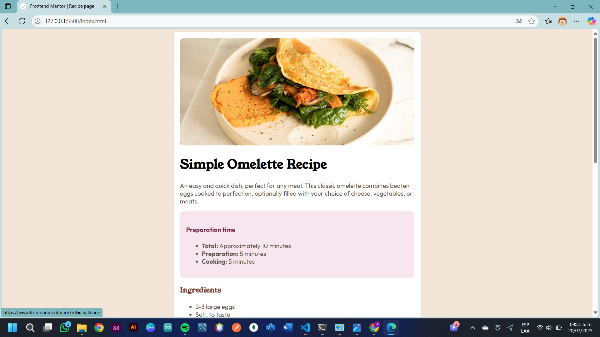
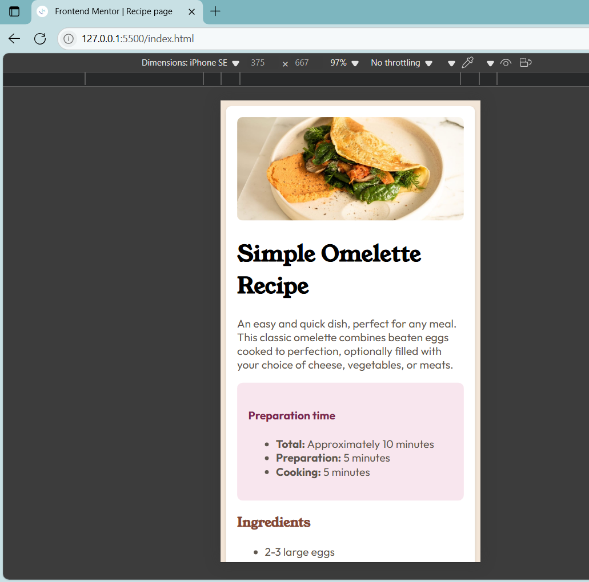

# Frontend Mentor - Recipe page solution

Esta es mi solución a [Recipe page challenge on Frontend Mentor](https://www.frontendmentor.io/challenges/recipe-page-KiTsR8QQKm). Este tipo de retos me ayudan a mejorar mis habilidades con HTML y CSS trabajando con proyectos reales.

## Table of contents

- [Overview](#overview)
  - [Screenshot](#screenshot)
  - [Links](#links)
- [My process](#my-process)
  - [Built with](#built-with)
  - [What I learned](#what-i-learned)
  - [Continued development](#continued-development)
- [Author](#author)

**Note: Delete this note and update the table of contents based on what sections you keep.**

## Overview

### Screenshot

### Links

- Solution URL: [Add solution URL here](https://your-solution-url.com)
- Live Site URL: [Add live site URL here](https://your-live-site-url.com)

## My process

### Built with

- Semantic HTML5 markup
- CSS custom properties
- Flexbox
- CSS Grid
- Mobile-first workflow

### What I learned

Aprendí a estructurar una página responsiva desde cero usando HTML y CSS puros, y a seguir una guía de estilos (style guide) para respetar tipografías, colores y espaciado. Tambien aprendi algo nuevo de GitHub gracias a su ayuda. 

### Continued development

Me gustaria seguir practicando con este tipo de proyectos y agregar JavaScrip.

## Author

- Website - [Abril](https://guzman-05.github.io/Recipe-Page/)
- Frontend Mentor - [@Abril](https://www.frontendmentor.io/profile/Guzman-05)
- Twitter - [@AbrilG94562](https://x.com/AbrilG94562)

